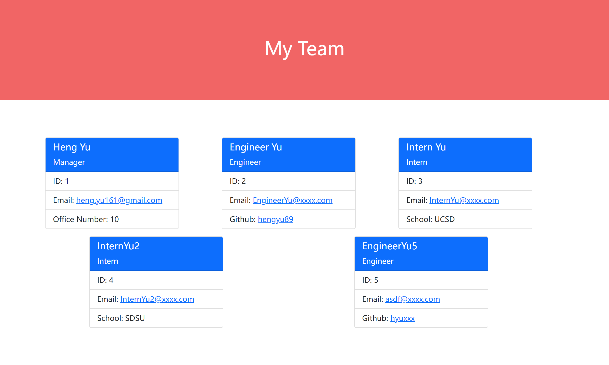

# UCSD_HW10_Team-Profile-Generator
This program is to build a Node.js command-line application that takes in information about employees on a software engineering team, then generates an HTML webpage that displays summaries for each person. Testing is key to making code maintainable, so it will also write a unit test for every part of our code and ensure that it passes each test.

## User Story

```
AS A manager
I WANT to generate a webpage that displays my team's basic info
SO THAT I have quick access to their emails and GitHub profiles
```

## Link to the Demo Video
* Click to watch the instructing video: [Demo in Youtube.](https://www.youtube.com/watch?v=HZ0OaQscWPw)

## Usage

* Javascript
* HTML
* package: inquirer, fs

## What I've done

* This program allows the user to write in the working team's information

* Firstly, program will require user to type in the information (name, id, email address, office number) of team manager.

* Once team manager's information is written, the program will jump into the menu to let user choose to add "Engineer" or "Intern" to build user's team. And the program will stop then user choose "Finish building team".

* Once the program is finished, the html file will be written into the root directory as name "index.file" (same folder with index.js).

## Screenshot:

